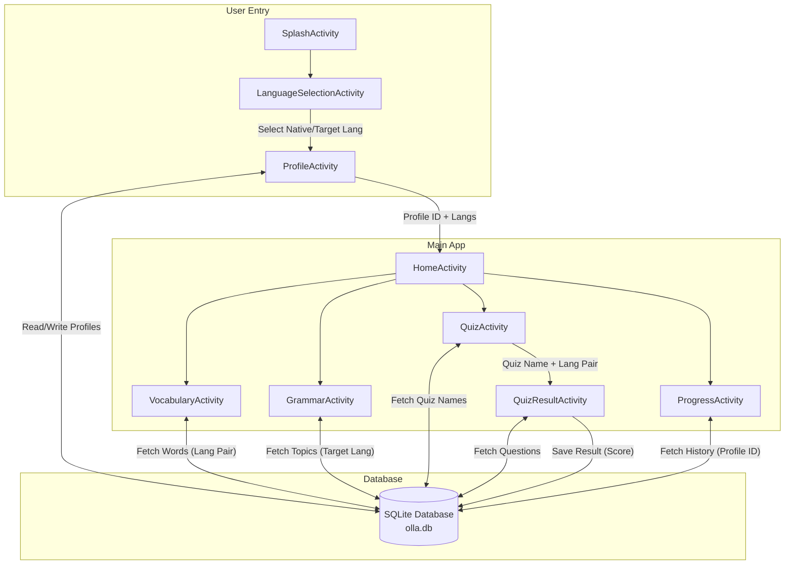
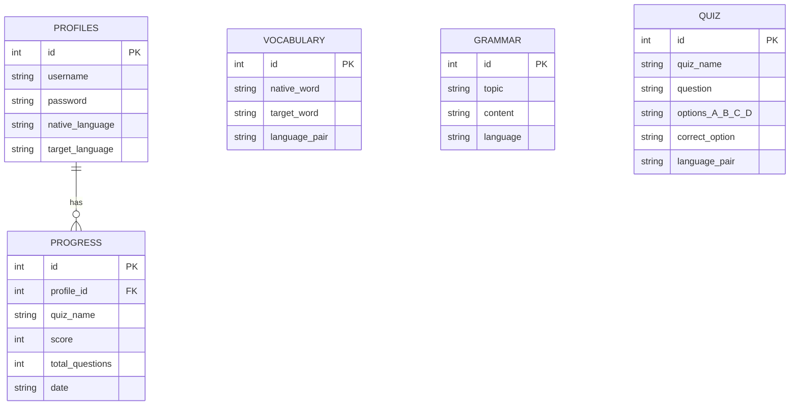
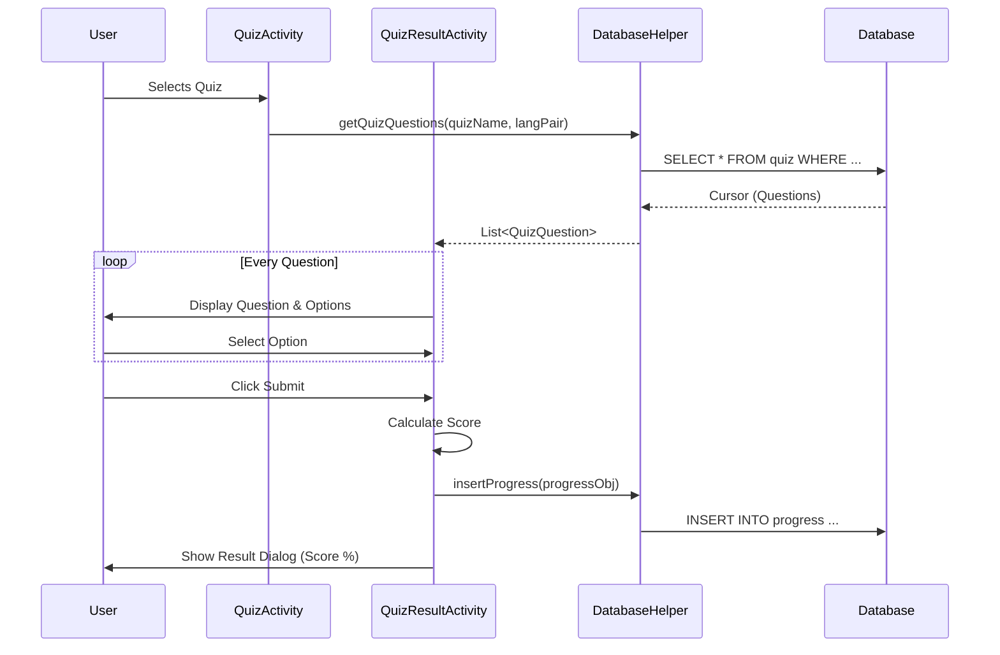

# Data Flow & Structure Visualizations

Here are the visual representations of how data flows and is structured within the OLLA application.

## 1. System Architecture & Data Flow
This diagram shows how data moves between the Activities and the Database.

## 2. Database Schema (ER Diagram)
This diagram illustrates the structure of the database tables and their relationships.

## 3. Quiz Feature Data Flow
A detailed look at how data is handled during a quiz session.

