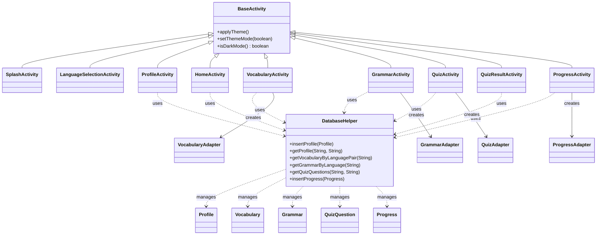
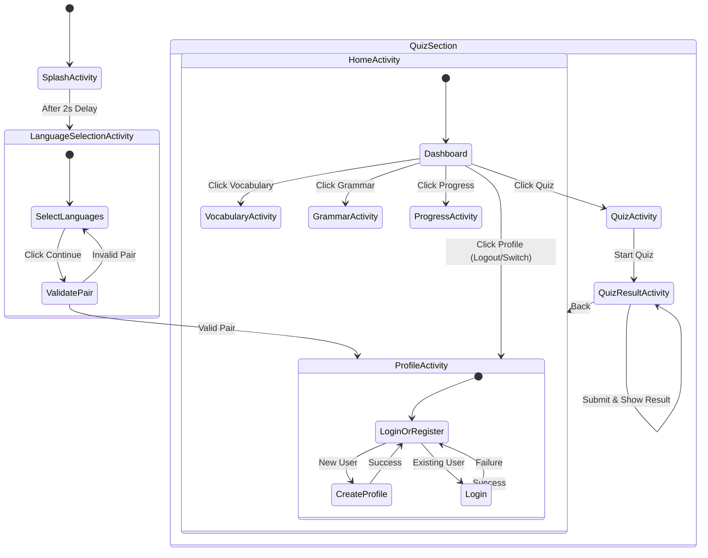
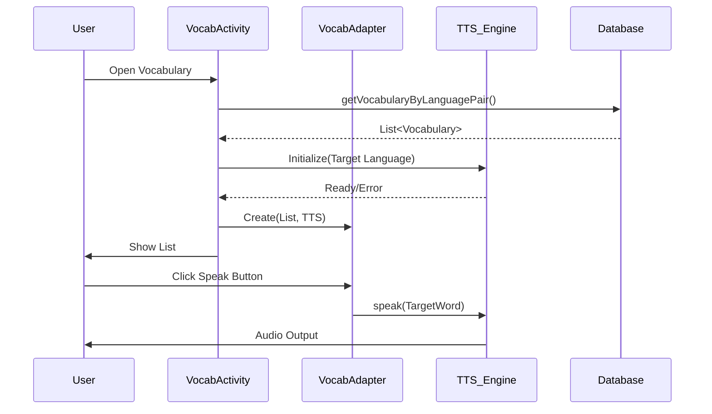

# Detailed Design

This document provides a deep dive into the application's internal structure and behavior.

## 1. Class Structure Diagram
This diagram illustrates the relationships between the main Java classes, including inheritance and dependencies.

## 2. UI Navigation Flow (State Diagram)
This diagram details the user's journey through the application screens and the conditions for transitions.

## 3. Vocabulary Component Interaction
A detailed view of how the Vocabulary feature works, including Text-to-Speech (TTS) integration.

