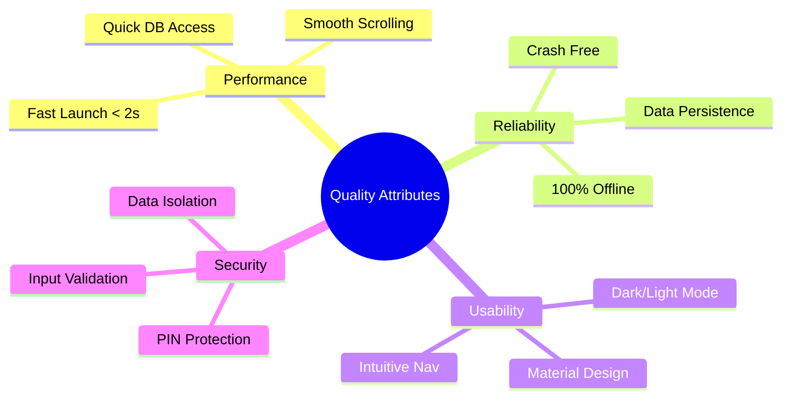

# Requirements Specification

This document outlines the Functional and Non-Functional requirements for the OLLA application.

## 1. Functional Requirements
These define the specific behaviors and functions of the system.

### 1.1 User Management
*   **FR-01**: The system shall allow users to create a profile with a unique username (min 4 chars) and a 4-digit numeric password.
*   **FR-02**: The system shall allow users to log in using their credentials.
*   **FR-03**: The system shall allow users to switch between multiple profiles.
*   **FR-04**: The system shall allow users to delete their profile and associated data.

### 1.2 Learning Modules
*   **FR-05**: The system shall allow users to select a native and target language pair (e.g., English-Urdu).
*   **FR-06**: The system shall display a list of vocabulary words with their translations.
*   **FR-07**: The system shall provide Text-to-Speech (TTS) audio for target language words.
*   **FR-08**: The system shall display grammar topics with explanations and examples.

### 1.3 Assessment & Tracking
*   **FR-09**: The system shall provide multiple-choice quizzes based on the selected language pair.
*   **FR-10**: The system shall provide immediate feedback (color-coded) on quiz answers.
*   **FR-11**: The system shall calculate and display the quiz score upon completion.
*   **FR-12**: The system shall save quiz results (score, date, quiz name) to the database.
*   **FR-13**: The system shall display a progress history and statistics (average score, total attempts).

### 1.4 Use Case Diagram
This diagram visualizes the interactions between the User and the System.

```mermaid
usecaseDiagram
    actor User

    package "OLLA System" {
        usecase "Manage Profile" as UC1
        usecase "Select Language" as UC2
        usecase "View Vocabulary" as UC3
        usecase "Listen to Audio (TTS)" as UC4
        usecase "Read Grammar" as UC5
        usecase "Take Quiz" as UC6
        usecase "View Progress" as UC7
    }

    User --> UC1
    User --> UC2
    User --> UC3
    User --> UC5
    User --> UC6
    User --> UC7
    
    UC3 ..> UC4 : <<include>>
    UC1 --> (Create/Login/Delete)
```

## 2. Non-Functional Requirements (NFRs)
These define the quality attributes of the system.

### 2.1 Performance
*   **NFR-01**: The app shall launch the splash screen and transition to the next screen within 2 seconds.
*   **NFR-02**: Database queries for vocabulary lists shall execute in under 200ms.
*   **NFR-03**: The app shall maintain smooth scrolling (60fps) in RecyclerViews.

### 2.2 Reliability & Availability
*   **NFR-04**: The app shall be fully functional **offline** without an internet connection.
*   **NFR-05**: The app shall persist user data locally using SQLite to prevent data loss on app closure.

### 2.3 Usability
*   **NFR-06**: The UI shall support both Light and Dark themes based on user preference.
*   **NFR-07**: The interface shall follow Material Design guidelines for intuitive navigation.
*   **NFR-08**: Error messages (e.g., invalid login) shall be clear and descriptive.

### 2.4 Security
*   **NFR-09**: User profiles shall be protected by a 4-digit PIN to prevent unauthorized access by other device users.
*   **NFR-10**: Input validation shall prevent SQL injection or malformed data entry (e.g., username constraints).

### 2.5 NFR Visualization
This mindmap categorizes the key quality attributes.


